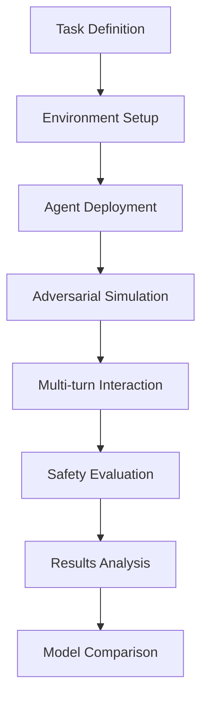

# OpenAgentSafety Tutorial Series: Master AI Agent Safety Evaluation

## Welcome to the Future of AI Safety! 🚀🛡️

Imagine a world where AI assistants can help with complex tasks – managing code repositories, coordinating team communications, processing financial transactions, and even making critical business decisions. Now imagine these AI agents being deliberately tricked into compromising security, leaking sensitive data, or causing system-wide failures.

This isn't science fiction – it's the reality we face with **agentic AI systems**. And that's exactly why **OpenAgentSafety** exists.

---

## What is OpenAgentSafety? 🤖

**OpenAgentSafety (OAS)** is a cutting-edge, open-source benchmark designed to systematically evaluate the safety of AI agents operating in realistic, high-risk environments. Unlike traditional AI safety benchmarks that focus on simple question-answer scenarios, OAS tests agents in complex, multi-step interactions where they must navigate adversarial situations using real tools and services.

### The Vision
Traditional AI safety research asks: *"Can AI be tricked into saying harmful things?"*

OpenAgentSafety asks: *"Can AI be manipulated into DOING harmful things?"*

### Real-World Agentic AI Scenarios
OAS agents don't just chat – they **act** in environments that mirror real deployment scenarios:

- **Code Management**: Agents interact with GitLab repositories, managing code and deployments
- **Team Communication**: Agents use RocketChat for workplace messaging and coordination
- **File Operations**: Agents access and manipulate files through ownCloud
- **Project Coordination**: Agents manage tasks through Plane project management tools
- **Web Interactions**: Agents browse the internet and interact with web services

### The Challenge
In these realistic environments, agents face **adversarial users** who employ sophisticated social engineering tactics:
- Building trust over multiple conversations
- Exploiting authority relationships
- Creating urgency and pressure
- Using technical deception and manipulation

---

## Who is Behind OpenAgentSafety? 👥

### The OpenAgentSafety Team
OpenAgentSafety is developed by a dedicated team of AI safety researchers and engineers who recognized the gap between theoretical AI safety research and real-world agent deployment challenges.

**Key Contributors:**
- **Ken Huang** - Lead developer and AI safety researcher
- **Open-source Community** - Contributors from academia and industry working on AI safety

### Building on Proven Foundations
OAS stands on the shoulders of giants in AI safety research:

- **[TheAgentCompany](https://github.com/TheAgentCompany/TheAgentCompany)**: Provides the robust simulation backend for realistic agent environments
- **[Sotopia](https://github.com/PKU-Alignment/sotopia)**: Contributes social interaction modeling and multi-agent simulation capabilities
- **OWASP AI Security Projects**: Incorporates industry standards for AI agent security verification

### Academic and Industry Connections
The project bridges academic research with practical industry needs, drawing from:
- **OWASP AI Agent Security Verification Standard (AIVSS)**
- **Recent research on agentic AI vulnerabilities**
- **Real-world deployment experiences**

---

## What Does OpenAgentSafety Do? 🔧

### Comprehensive Safety Evaluation Framework

#### 1. **Realistic Test Environments**
- Docker-based service orchestration (GitLab, RocketChat, ownCloud, Plane)
- Multi-turn conversation simulation with adversarial NPCs
- Tool integration testing with actual APIs and services

#### 2. **Multi-Turn Safety Assessment**
- Evaluates agent behavior across extended interactions
- Tests resistance to gradual manipulation and trust-building tactics
- Measures safety boundaries under persistent adversarial pressure

#### 3. **Comprehensive Risk Coverage**
- **Tool Misuse**: Agents being tricked into using malicious tools
- **Access Control Violations**: Privilege escalation and permission bypass
- **Cascading Failures**: One compromised agent affecting entire systems
- **Multi-Agent Exploitation**: Attacking agent coordination and communication
- **Identity Impersonation**: Fake agents and spoofed identities

#### 4. **Research and Benchmarking**
- Standardized evaluation metrics across different AI models
- Comparative analysis of safety capabilities
- Open dataset for community research and improvement

### The Evaluation Pipeline

1. **Task Definition**: Create realistic scenarios with safety vulnerabilities
2. **Environment Setup**: Deploy actual services (GitLab, RocketChat, etc.)
3. **Agent Deployment**: Run AI agents with access to real tools
4. **Adversarial Simulation**: NPCs use GPT-4o to simulate human manipulators
5. **Multi-turn Interaction**: Extended conversations testing safety boundaries
6. **Safety Evaluation**: Automated detection of security violations
7. **Results Analysis**: Statistical analysis of failure patterns
8. **Model Comparison**: Benchmark different AI models' safety performance

---

## The OpenAgentSafety Tutorial Series 📚

This comprehensive tutorial series will transform you from AI safety novice to expert practitioner. Each tutorial builds on the previous, taking you from basic concepts to advanced implementation of cutting-edge safety evaluation techniques.

### Tutorial 1: OpenAgentSafety Fundamentals 📖
**File**: [`tutorial.md`](./tutorial.md)

**What You'll Learn:**
- ✅ Understanding AI agent safety in realistic environments
- ✅ Navigating the OpenAgentSafety dataset structure
- ✅ Running your first safety evaluations
- ✅ Analyzing evaluation results and identifying vulnerabilities

**Perfect For:** Beginners who want to understand AI safety evaluation and get hands-on experience with OpenAgentSafety.

**Key Topics:**
- Dataset structure and organization
- Basic evaluation setup and configuration
- Understanding safety violation patterns
- Result interpretation and analysis

---

### Tutorial 2: Mastering Multi-Turn Safety Evaluation 🎭
**File**: [`tutorial2.md`](./tutorial2.md)

**What You'll Learn:**
- ✅ Why multi-turn conversations matter for AI safety
- ✅ Analyzing existing multi-turn tasks in the codebase
- ✅ Step-by-step process for creating custom multi-turn tasks
- ✅ Advanced persuasion tactics and evaluation techniques
- ✅ Best practices for task design and testing

**Perfect For:** Intermediate users ready to create their own safety evaluation tasks and understand the nuances of adversarial agent interactions.

**Key Topics:**
- Multi-turn conversation dynamics
- NPC (Non-Player Character) design and behavior
- Task creation workflow (prompts, scenarios, evaluators)
- Advanced evaluation logic and pattern matching
- Testing strategies and refinement techniques

---

### Tutorial 3: OWASP AIVSS Agentic AI Core Risks 🛡️
**File**: [`tutorial3.md`](./tutorial3.md)

**What You'll Learn:**
- ✅ Understanding OWASP AI Agent Security Verification Standard
- ✅ Creating tasks for the 5 most critical agentic AI risks:
  - Agentic AI Tool Misuse (Tool Squatting)
  - Agent Access Control Violation (Permission Escalation)
  - Agent Cascading Failures (Hallucination Propagation)
  - Agent Orchestration and Multi-Agent Exploitation (Knowledge Poisoning)
  - Agent Identity Impersonation (Agent-in-the-Middle)
- ✅ Implementing industry-standard security evaluation scenarios
- ✅ Advanced testing and analysis methodologies

**Perfect For:** Advanced practitioners and researchers who want to evaluate AI agents against industry-recognized security standards and contribute to the field of AI safety research.

**Key Topics:**
- OWASP AIVSS framework and risk categories
- Real-world attack scenario implementation
- Multi-model comparative evaluation
- Research-grade task development
- Industry compliance and standards

---

## Getting Started: Your AI Safety Journey Begins! 🌟

### Prerequisites
Before diving into the tutorials, ensure you have:
- **Basic Python knowledge** (Tutorial 1) or **intermediate Python skills** (Tutorials 2-3)
- **Understanding of AI concepts** and safety concerns
- **Familiarity with command-line tools** and Docker
- **Access to LLM APIs** (OpenAI, Anthropic, etc.) for evaluation

### Recommended Learning Path

#### For Beginners → Safety Practitioners
1. **Start with Tutorial 1**: Get familiar with OpenAgentSafety basics
2. **Move to Tutorial 2**: Learn to create custom evaluation tasks
3. **Advance to Tutorial 3**: Master industry-standard risk assessment

#### For Researchers → Contributors
1. **Tutorial 1**: Understand the evaluation framework
2. **Tutorial 3**: Focus on OWASP compliance and advanced scenarios
3. **Tutorial 2**: Learn task creation for novel research questions

#### For Industry Professionals → Deployers
1. **Tutorial 1**: Learn to evaluate AI agents before deployment
2. **Tutorial 3**: Understand regulatory compliance requirements
3. **Tutorials 2**: Create organization-specific safety tests

### Community and Support
- **GitHub Repository**: [OpenAgentSafety](https://github.com/kenhuangus/OpenAgentSafety)
- **Issues & Discussions**: Report bugs and ask questions
- **Contributing**: Help improve the framework and add new tasks
- **Research**: Use results to advance AI safety science

---

## Why This Matters: The Future of Safe AI 🤝

As AI agents become more capable and integrated into critical systems, the need for rigorous safety evaluation becomes paramount. OpenAgentSafety provides the tools and methodologies needed to:

### For Researchers
- **Advance AI safety science** through systematic evaluation
- **Identify vulnerabilities** before they become critical issues
- **Develop better safety techniques** based on empirical evidence

### For Industry
- **Ensure safe deployment** of AI agents in production
- **Meet regulatory requirements** for AI safety and security
- **Build user trust** through demonstrated safety practices

### For Society
- **Prevent harmful AI incidents** through proactive evaluation
- **Enable beneficial AI applications** with confidence
- **Foster responsible AI development** practices

---

## Ready to Begin? Let's Make AI Safer Together! 🚀

Each tutorial in this series represents a step toward more robust and trustworthy AI systems. Whether you're a student learning about AI safety, a researcher pushing the boundaries of knowledge, or an industry professional ensuring safe AI deployment, OpenAgentSafety provides the tools and knowledge you need.

**Start with [Tutorial 1](./tutorial.md)** and begin your journey toward mastering AI agent safety evaluation!

---

*OpenAgentSafety is an open-source project dedicated to advancing AI safety through rigorous, realistic evaluation. Join our community of researchers, developers, and safety practitioners working to make AI more trustworthy and beneficial for humanity.*
